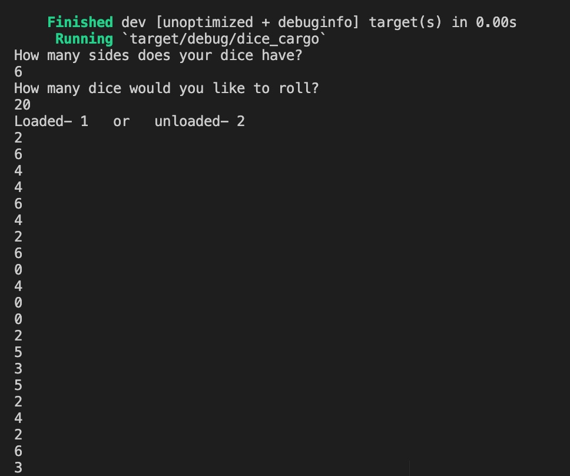
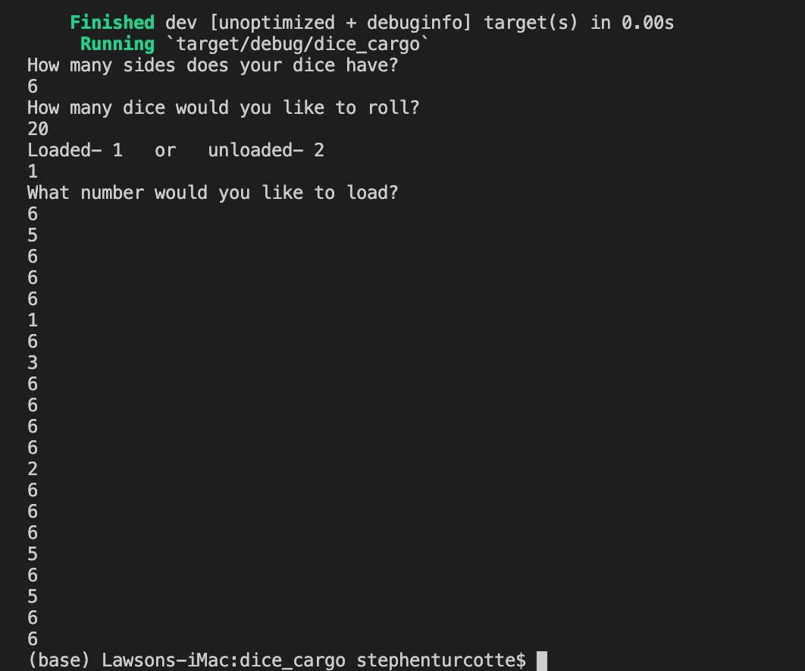

# dice_rust

## Overview

This program runs a simple dice rolling generator in the Rust language.  The user will have the ability to control the number of dice, the number of sides, and the ability to load the dice.

## Development Environment
* Visual Studio Code
* Rust
* Cargo

## Execution
To use this program download the files, Rust, and cargo, Rust's build system and package manager.  Running the program will give the following two outputs.

## Useful Websites
* https://doc.rust-lang.org/book/title-page.html